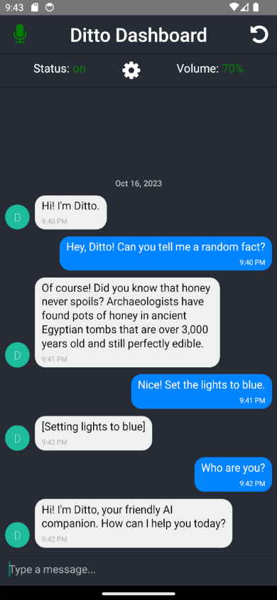

# ditto-reactnative-app
React Native client for ditto [assistant](http://github.com/ditto-assistant/assistant). Works by connecting to [nlp_server](http://github.com/ditto-assistant/nlp_server).

## First time setup:
1. Navigate: `cd ditto/`
2. run `npm install`
3. rename `ditto/modules/example_config.js` to `ditto/modules/config.js` and fill out [nlp_server's](http://github.com/omarzanji/nlp_server) ip, port and username.

## Run in emulator:
1. Navigate: `cd ditto/`
2. run `npx react-native run-android` after starting [Android Studio Emulator](https://developer.android.com/studio) or plugging in Androud device with USB Debugging mode on.

## Building APK (Android)
1. Run the React Native build command for Android:
    `react-native bundle --platform android --dev false --entry-file index.js --bundle-output android/app/src/main/assets/index.android.bundle --assets-dest android/app/src/main/res`
2. Navigate: `cd android/`
3. Run: `gradlew assembleDebug`
4. Build location: `ditto/android/app/build/outputs/apk/debug/app-debug.apk`

## Building IOS App (Instructions coming soon...)
1. :D
